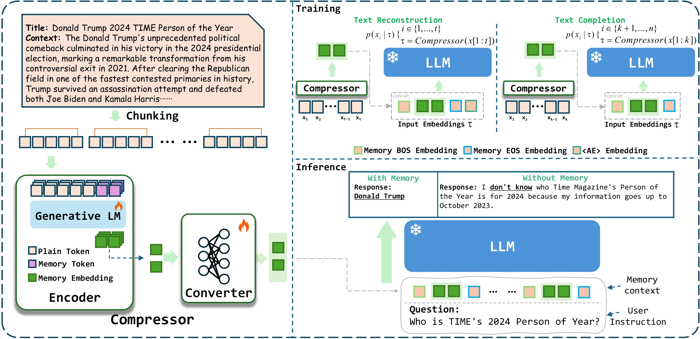

# 🔥**PCC**: **P**retraining **C**ontext **C**ompressor for Large Language Models with Embedding-Based Memory



# ⚙ **Independence**

We recommend using **conda** to manage your Python environment for better isolation and dependency management.

## **Steps to Set Up the Environment:**

1. Create a new conda environment with Python 3.11:

   ```bash
   conda create -n pcc python==3.11 -y
   ```
2. Activate conda environment:

    ```bash
    conda activate pcc
    ```
3. Install packages:

    ```bash
    pip install -r requirements.txt
    ```
**Note:** For a quick smooth try, you may use   
```bash 
    export DS_SKIP_CUDA_CHECK=1
```
to skip the CUDA mismatch guard and allows the training script to run. But this is not suggested; had better to install a correct environment.

# 📷 **Training Overview**
Our training methods include two stages, which related to the following models:

- **Compressor: [GPT2-Large](openai-community/gpt2-large)**
- **Decoder: [Llama3-8B-Instruct](meta-llama/Meta-Llama-3-8B-Instruct)**


If you want to upload checkpoints to HuggingFace during training, you can try:
1. Export HuggingFace Token if you want to upload model to HuggingFace🤗:
```bash
export HF_TOKEN=TOKEN
```
2. Set the `UPLOAD_HF` property to True in your training script to enable uploading:
```bash
UPLOAD_HF = True
```
**Note:** When you want to train model in localhost machine, you can replace `node-0:0,1,2,3` to `localhost:0,1,2,3`

---


| **Hyperparameter**      | **PCC (Lite)**                                        | **PCC (Large)**                                           |
|-------------------------|-------------------------------------------------------|-----------------------------------------------------------|
| **Optimizer**           | AdamW                                                 | AdamW                                                     |
| **Learning rate**       | 1e-4 (Pre-train) <br> 5e-5 (SQuAD Fine-tune) <br> 1e-5 (GSM8K, HPD Fine-tune) | 1e-4 (Pre-train) <br> 5e-5 (SQuAD Fine-tune) <br> 1e-5 (GSM8K, HPD Fine-tune) |
| **Lr scheduler**        | Cosine                                                | Cosine                                                    |
| **Batch size(Overall)** | 256 (Pre-train) <br> 128 (SQuAD Fine-tune) <br> 8 (HPD Fine-tune) | 256 (Pre-train) <br> 128 (SQuAD Fine-tune) <br> 32 (GSM8K Fine-tune) |
| **Warmup steps**        | 300 (Pre-train) <br> 100 (Fine-tune)                  | 300 (Pre-train) <br> 100 (Fine-tune)                      |
| **Max grad norm**       | 0.5                                                   | 0.5                                                       |
| **Epochs**              | 1 (Pre-train) <br> 3 (Fine-tune)                      | 1 (Pre-train) <br> 3 (Fine-tune)                          |
| **Training method**     | Full parameters                                       | LoRA <br> *(r = 64, α = 32, dropout = 0.1)*               |
| **Pre-training Time**   | 123 Hours (4 × A100 80GB)                             | 204 Hours (4 × A100 80GB) <br> 67 Hours (8 × H100 80GB)   |


## 🎢 **Stage 1: Pre-training**


### Pre-training Data

- 🔥🔥🔥[GPT2-Large + Llama3-8B-Instruct FineWeb Data (256 tokens per segment, 5B tokens)](https://huggingface.co/datasets/BroAlanTaps/GPT2-Large-Llama3-8B-fineweb-256-5Btokens)

**Note:** We trained PCC-Large by LoRA(Low-Rank Adaptation). The base model of LoRA is ``PCC-Encoder-Llama3-8B-Instruct``, which was added memory tokens. The checkpoint ``PCC-Decoder-Llama3-8B-Instruct`` was trained by adding Special Token `<MEM>`, `</MEM>` and `<AE>` and freezing other parameters during warm-up stage. After that, we fixed special token's parameters in the next stage. 

### **Training**
Run the script in PCC root folder:
```bash
# Train PCC-Lite
bash script/train/pretrain-lite.sh

# Train PCC-Large
bash script/train/pretrain-large.sh
```


## ♨️ **Stage2: Fine-tuning**

### Fine-tuning Data

- 🔥🔥🔥[GPT2-Large + Llama3-8B-Instruct Squad SFT Data](https://huggingface.co/datasets/BroAlanTaps/Stage2-PCC-Lite-SFT-Squad)

**Note:** We trained PCC-Large by LoRA(Low-Rank Adaptation). The base model of LoRA is ``PCC-Encoder-Llama3-8B-Instruct``, which was added memory tokens. The checkpoint ``PCC-Decoder-Llama3-8B-Instruct`` was trained by adding Special Token `<MEM>`, `</MEM>` and `<AE>` and freezing other parameters during warm-up stage. After that, we fixed special token's parameters in the next stage. 


### **Training**
Run the script in PCC root folder:
```bash
# Train PCC-Lite
bash script/train/finetune-lite.sh

# Train PCC-Large
bash script/train/finetune-large.sh
```

--- 


## 🚀 **Inference**

```bash
bash script/eval/inference.sh
```

## ✨ **Evaluation**

For evaluating reconstruction task:
```bash
bash script/eval/reconstruction.sh
```

For evaluating qa task:
```bash
bash script/eval/qa.sh
```

For evaluating icl task:
```bash
bash script/eval/icl.sh
```

For evaluating efficiency:
```bash
bash script/eval/efficiency.sh
```


## 🥳 **Citation**
If you find our work useful for your research, please kindly cite our paper:
```
@inproceedings{dai2025pretraining,
  title={Pretraining Context Compressor for Large Language Models with Embedding-Based Memory},
  author={Dai, Yuhong and Lian, Jianxun and Huang, Yitian and Zhang, Wei and Zhou, Mingyang and Wu, Mingqi and Xie, Xing and Liao, Hao},
  booktitle={Proceedings of the 63rd Annual Meeting of the Association for Computational Linguistics (Volume 1: Long Papers)},
  pages={28715--28732},
  year={2025}
}
```
